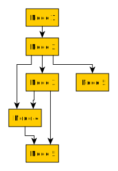

# DAG asynchronous process runner

## Motivation

This package solves the problem of running multiple dependent actions (or
tasks) in parallel.

If you're familiar with [GNU Make][1], the following table lists somewhat
comparable terms:

| dagproc    | GNU Make       |
| ---------- | -------------- |
| Process    | "make" command |
| pipeline   | Makefile       |
| Node       | rule           |
| id         | target name    |
| parent id  | dependency     |

## Description

Package's main entities are listed below.

### Node

Node interface represents a basic building block.  Each node can have zero or
more dependencies (or prerequisites).  Each Node have a Do method, which is
executed when all of the parent nodes have completed execution (therefore, all
prerequisites are met).

Simply define these three methods on your structure to use it with this
package:

- ID() string: ID should return an ID, i.e. "3".  ID must be unique across all
  nodes.
- ParentIDs() []string: ParentIDs should return a slice of IDs that this node
  depends on, i.e. ["1", "2"].
- Do() error: Do should execute the node action and return an error.  If it
  returns ErrIgnore, the error will be ignored, with the message in
  ErrIgnore (you can use the NewIgnoreError to initialise it). Any other
  error will lead to process termination.

Node is an equivalent of GNU Make "target".

## Process
Process function executes the actions defined by the Nodes in an ordered
manner.

When Process function is called with a slice of nodes, it builds a graph, in
which each vertex is linked to a Node with the same index, with edges of the
graph connecting dependent nodes.

Nodes that do not have a common dependency, will be executed asynchronously,
if number of worker goroutines allows for that (see example).

Process is an equivalent of a running instance of GNU Make aganst a Makefile.

## Example 1

The example shows how the Process would deal with the sample pipeline and
in which order the Node actions will be executed.

Run parameters:

- Number of workers: 2;
- Node action: sleep(1 sec)
- Pipeline:

0. Process starts.
1. Node 1 action is executed, prerequisite for Node 2 is satisfied.
2. Node 2 action is executed — prerequisite for Node 3 and Node 5 is
   satisfied, and one of the two prerequisites for Node 4 is satisfied.
3. We are running with two concurrent workers, Node 3 and Node 5 actions are
   executed at the same time.  When Node 3 action is complete, all
   prerequisites for node 4 are satisfied, and one of the two prerequisites
   for Node 6 is satisfied.
4. Node 4 action is executed, all prerequisites for Node 6 are satisfied.
5. Node 6 action is executed.
6. Process finishes.

[1]: https://www.gnu.org/software/make/
