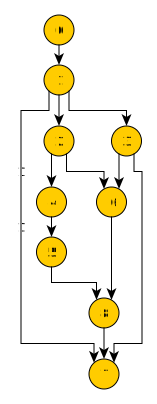

# Simple Delay Node Example

Example shows the usage of dagproc for walking the following Directed Acyclic
Graph:




Each `DelayNode` has an ID and ParentIDs which contains zero or more IDs of
the nodes that it depends on.

`DelayNode` satisfies the `Node` interface by implementing the following
methods:

- `ID` - returns the node ID;
- `ParentIDs` - returns the slice of parent IDs
- `Do` - delays for `delay` seconds.

Run it with:

```shell
DEBUG=1 go run .
```

Default number of workers is four, you can modify it with `-w` flag:

```shell
DEBUG=1 go run . -w 16
```
